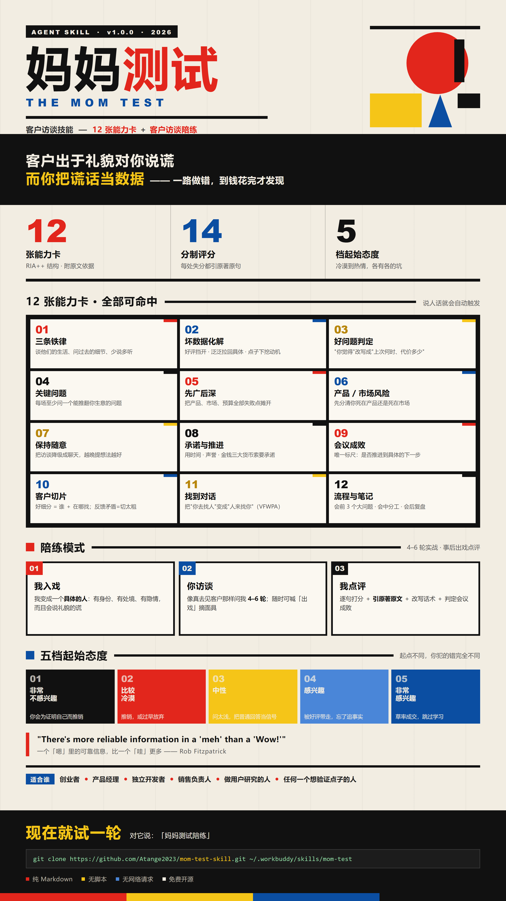

<div align="center">



# 妈妈测试 · The Mom Test

**客户访谈技能 —— 12 张能力卡 ＋ 一个会说谎的模拟客户**

[](CHANGELOG.md)
[](LICENSE)
[](#安装)
[](#安全说明)

> 客户出于礼貌对你说谎，而你把谎话当数据 —— 一路做错，到钱花完才发现。

**装好之后，你有两件事可以做**：问它该怎么问（12 张能力卡），或者练一遍怎么问（模拟客户陪练）。

[30 秒装好](#30-秒装好) · [陪练模式](#二练它--陪练模式) · [12 张能力卡](#12-张能力卡) · [FAQ](#faq)

</div>

---

## 你是不是也遇到过这些？

| 你经历过的 | 真相 |
|---|---|
| 问了一圈客户，所有人说「这个想法挺好的」，然后一个人都没买 | 好评是**坏数据**，不是信号 |
| 客户说「很有兴趣，资料发我看看」，然后再也没有然后 | 这是**僵尸线索**，会议其实已经失败了 |
| 访谈提纲写着「你觉得这个功能有用吗」「你愿意付多少钱」 | 意见题 + 未来时 → **必然收到谎言** |
| 每个客户抱怨的都不一样，不知道该先做哪个细分 | 反馈矛盾 = **你切得还不够细** |
| 聊得挺顺利、挺开心，回来却写不出任何一条可执行结论 | 顺利 ≠ 有收获；你只是**听得多、问得浅** |

问题不在你的执行力，在于**你拿到的根本不是数据**。

这个技能把《The Mom Test》的判定标准变成**随时可调用、可反复练习**的能力 —— 让你在花掉几个月和一笔钱之前，先发现自己的假设是错的。

---

## 30 秒装好

```bash
# macOS / Linux
git clone https://github.com/Atange2023/mom-test-skill.git ~/.workbuddy/skills/mom-test
```

```powershell
# Windows (PowerShell)
git clone https://github.com/Atange2023/mom-test-skill.git "$env:USERPROFILE\.workbuddy\skills\mom-test"
```

> 不用 git？点本页右上角 **Code → Download ZIP**，解压后把文件夹重命名为 `mom-test`，放进 `~/.workbuddy/skills/`。

装好就能用，**不需要任何配置**。更多安装方式见 [安装](#安装)。

---

## 它给你什么

### 一、问它 —— 能力卡

直接说人话就会自动触发，比如：

- 「我要去见一批客户，帮我设计不诱导的访谈问题」
- 「我做了一轮访谈，客户都说不错，我能信吗」 ← 大概率不能
- 「客户说很有兴趣但一直不买，怎么办」
- 「帮我看看这份访谈提纲，哪些问题会带偏对方」
- 「我不知道该先切哪个细分市场」

你会拿到**判定 + 改写**，而不是一堆道理：这句话为什么是坏问题、书里怎么说的、换成哪一句。

### 二、练它 —— 陪练模式

这是这个技能最有意思的部分。对它说 **「妈妈测试陪练」**，然后告诉它三件事：

1. **你是谁**（你的身份 / 角色）
2. **你想卖什么**（产品、服务，或任何你想验证的东西）
3. **客户开局是什么态度**（五档，见下表）

然后它**变成一个具体的客户**，跟你聊 4–6 轮 —— 会说礼貌的谎、会含糊、会白送你好评。聊完它摘下面具，逐句给你打分、**引原著原句**、把坏问题改写好，并判定这场会议是成是败。

#### 真实的一段（第 2 场陪练节选）

> **你**：您觉得目前能承受的学费是多少，多久可以正式报名？
> **她**：学费这个……我得回去跟家里商量一下。你们先给我发份资料，我手上另外两家也在看。

**点评**：一句话踩了三个坑。

| 你说的 | 为什么错 | 应该改成 |
|---|---|---|
| 「您觉得目前能承受的学费是多少」 | `Opinions are worthless.` 意见题；数字会带来**虚假的严谨感** | 「您现在在看的另外两家，学费大概什么区间？」 |
| 「多久可以正式报名」 | `Anything involving the future is an over-optimistic lie.` 未来时必然乐观 | 「您上一次为进修占用周末是什么时候？后来坚持了多久？」 |
| 「我为您准备资料表 + 学费方案」 | 单向付出，对方**零成本**；也没给她**拒绝的机会** | 「下周同一时间我带您见一位在读学员，20 分钟？」 |

**结论**：以「发资料 + 保持联系」结束 = 教科书级**僵尸线索**，这场会议**失败**。

#### 五档起始态度：起点不同，你犯的错完全不同

| 起点 | 它开局什么样 | 你最容易犯的错 |
|---|---|---|
| ① 非常不感兴趣 | 冷淡、想结束 | **推销** —— 为证明自己有价值而猛讲产品 |
| ② 比较冷漠 | 礼貌但平，「嗯」「还行」 | 推销，或**过早放弃** —— 误判为失败就停 |
| ③ 中性 | 就事论事，一问一答 | **问太浅** —— 把普通回答当信号，不挖细节 |
| ④ 感兴趣 | 主动发问、顺手给好评 | **被好评带走** —— 忘了追事实 |
| ⑤ 非常感兴趣 | 热情、「我现在就想报」 | **草率成交** —— 直接报价，跳过学习 |

> 书里说：*"There's **more reliable information in a 'meh' than a 'Wow!'**"* —— 一个「嗯」比一个「哇」更有信息量。**起点越高，你越容易短路。**

#### 陪练结束后你会拿到

- 逐句点评（哪句是坏问题、为什么）
- **14 分制评分表**（7 个维度 × 2 分）
- 每处失分对应的**原著英文原句 + 中译 + 章节号**
- 你的坏问题 → 改写话术对照表
- **会议成败判定**：你拿到承诺或推进了吗？
- ⭐ **起始态度复盘**：这轮是起点害了你，还是手艺没到位
- 助教布置：下一步该读哪张卡、真实工作里立刻能用的一个动作

---

## 12 张能力卡

每张卡都是 **RIA++ 结构**：`R 原文（英文原句 + 中译 + 章节）→ I 方法论骨架 → A1 应用示例 → A2 触发场景 → E 可执行步骤 → B 边界`。

| # | 能力卡 | 一句话规则 |
|---|---|---|
| 01 | `mom-test-three-rules` | 三条铁律：谈他们的生活、问过去的细节、少说多听 |
| 02 | `bad-data-triage` | 好评挡开、泛泛拉回具体、点子下挖动机 |
| 03 | `question-quality-gate` | 把「你觉得 / 你会不会 / 愿付多少」改写成「你现在怎么做 / 上次何时 / 代价多少」 |
| 04 | `important-questions` | 每场对话至少问一个**能推翻你当前生意**的问题 |
| 05 | `zoom-control` | 先广后深；把产品、市场、预算等所有失败点摊开 |
| 06 | `product-market-risk` | 先分清风险在产品还是在市场 |
| 07 | `keeping-casual` | 把访谈降级成随意的聊天，越晚提到你的想法越好 |
| 08 | `commitment-advancement` | 用**时间 / 声誉 / 金钱**三大货币索取承诺 |
| 09 | `meeting-outcome` | 会议非成即败，唯一标尺是「是否推进到下一步」 |
| 10 | `segmentation-slicing` | 好细分是「谁 + 在哪找」；反馈矛盾说明切得不够细 |
| 11 | `finding-conversations` | 把「你去找人」变成「人来找你」（含 VFWPA 邀约框架） |
| 12 | `conversation-process` | 会前 3 个大问题、会中两人分工、会后团队复盘 |

外加 `references/` 里的速查表、术语表、全书概览与完整关键词索引。

---

## ⚠️ 它不做什么（请务必知道）

**陪练是飞行模拟器，不是市场调研。**

模拟客户是编出来的，所以它：

| ✅ 可以用来 | ❌ 不能用来 |
|---|---|
| 练提问手艺：不诱导、挡好评、拉回具体、下挖动机、索取承诺 | 判断你的生意好不好、市场大不大 |
| 发现自己哪句话在「卖点子」、哪句问成了未来时 | 替代真实客户对话 |
| 练会议收尾：怎么拿到一个新的具体线索 | 得到任何真实数据 |

**一分真实数据都换不来。** 它唯一的价值是让你在真实客户面前少犯错。

另外：本技能不适用于纯信息查询、书摘读后感、扮演作者本人，以及任何不需要与真实客户对话的场景。

---

## 安装

### WorkBuddy / CodeBuddy

放进技能目录，文件夹名为 `mom-test`：

```
~/.workbuddy/skills/mom-test/
├── SKILL.md
└── references/
```

| 平台 | 技能目录 |
|---|---|
| WorkBuddy | `~/.workbuddy/skills/` |
| CodeBuddy | `~/.codebuddy/skills/` |

### 其他 Agent

任何支持 `SKILL.md` 规范的 Agent 同理 —— 放进它的 skills 目录、文件夹名为 `mom-test` 即可。本技能**纯 Markdown，无脚本、无网络请求、无外部依赖**。

---

## 文件结构

```
mom-test-skill/
├── SKILL.md                          # 技能主入口：触发条件、能力路由表、核心原则
├── README.md                         # 本文件
├── NOTICE.md                         # 来源、引用范围与许可说明
├── LICENSE                           # MIT
├── assets/
│   ├── poster.png                    # 宣传海报（9:16，2700×4800）
│   └── poster-mom-test.html          # 海报源码（可直接改字改色）
├── references/
│   ├── capabilities/                 # 12 张 RIA++ 能力卡
│   ├── trainer-mode.md               # 陪练模式：演练流程 + 评分表 + 助教职责 + 首轮引导语
│   ├── capability-index.md           # 完整意图与关键词索引
│   ├── cheatsheet.md                 # 决策规则速查（一句话版）
│   ├── glossary.md                   # 术语表
│   └── overview.md                   # 全书概览
└── BUILD_MANIFEST.json               # 构建元数据
```

---

## FAQ

<details>
<summary><b>陪练里的客户是 AI 编的，那我练它有什么用？</b></summary>

它练的是**你的手艺**，不是验证你的生意。真实客户不会给你重来一次的机会，模拟客户会。

一个已经出现过的例子：有人在模拟里问了「您觉得学费能承受多少」，被点评后改成问事实 —— 这个改动带到真实访谈里，就是拿到真实数据还是拿到谎话的区别。
</details>

<details>
<summary><b>为什么技能名是 <code>mom-test</code> 而不是 <code>MOM_TEST</code>？</b></summary>

Agent 技能命名规范要求小写 kebab-case，编译与加载工具链也依赖这一点。口头叫它「妈妈测试」「MOM_TEST」都可以，触发不受影响。
</details>

<details>
<summary><b>它会动我的数据吗？</b></summary>

不会。整个技能是 18 个 `.md` + 1 个 `.json`，**没有一行可执行代码**，不含网络请求、不读取任何本地文件、不发送任何数据。你可以直接用文本编辑器逐行审查。
</details>

<details>
<summary><b>我该从哪张卡开始读？</b></summary>

按这个顺序：`mom-test-three-rules`（总纲）→ `bad-data-triage`（最常见的坑）→ `important-questions`（最难的一项）→ `commitment-advancement`（最容易被忽略的一项）。

或者更省事：直接开一轮陪练，它会在点评时告诉你该读哪张。
</details>

<details>
<summary><b>能不能换行业 / 换场景？</b></summary>

可以，而且**越具体越好**。把你自己的真实身份、真实产品、真实客户类型填进去 —— 陪练会据此生成一个「谁 + 在哪找」都很具体的角色，并埋好可挖出的已付费事实和隐藏阻力。

换一个细分，答案全变 —— 这正是书里说的第一件事。
</details>

---

## 安全说明

发布前的自检结果：

| 检查项 | 结果 |
|---|---|
| 可执行脚本（非 `.md` / `.json`） | **0** |
| `curl` / `wget` / `Invoke-WebRequest` / `fetch(` / `exec(` / `eval(` | 命中 **0** |
| `subprocess` / `os.system` / `rm -rf` / `shutil.rmtree` / `chmod +x` | 命中 **0** |
| `api_key` / `token` / `password` / `secret` / `Authorization` | 命中 **0** |
| 外发 URL（`http://` / `https://`） | 命中 **0** |
| 隐藏文件 / 符号链接 | **0** |

**纯 Markdown，无脚本、无网络请求、无外部依赖。** 装上去不会动你的任何数据。

---

## 来源与许可

方法论来自 **Rob Fitzpatrick, _The Mom Test_ (2013)**。本仓库是**方法论的再组织与教学化改写**，为标注出处保留了少量英文原句与章节号，**不包含原书正文或大段摘录**。

> 强烈建议读原书 —— 它很短，两小时能读完。本技能的目标是**帮你把书里的手艺练熟**，而不是让你不用读书。
> 官方站点：<https://www.momtestbook.com/>

本项目原创内容采用 **MIT 许可**；`R — 原文` 中的英文原句版权归作者所有，仅作教学标注。详见 [`NOTICE.md`](NOTICE.md)。

---

## 改进它

发现某张卡不准确、或陪练体验有问题，欢迎提 Issue / PR。同事试完有反馈也可以直接发我。

**Roadmap**

- [ ] 客户角色库：更多行业 / 更多细分场景（医疗器械、SaaS、线下服务、企业内部工具…）
- [ ] 能力卡的本土案例补充
- [ ] 评分表权重校准（目前 7 维 × 2 分，可能应该按维度加权）
- [ ] 陪练战绩存档与进步曲线

**贡献方式**：能力卡照 RIA++ 六段结构写；陪练相关改动请同时说明它对照的是原著哪一条规则。

---

<div align="center">

**客户不会告诉你真相 —— 但你可以学会问出真相。**

[⬆ 回到顶部](#妈妈测试--the-mom-test)

</div>
